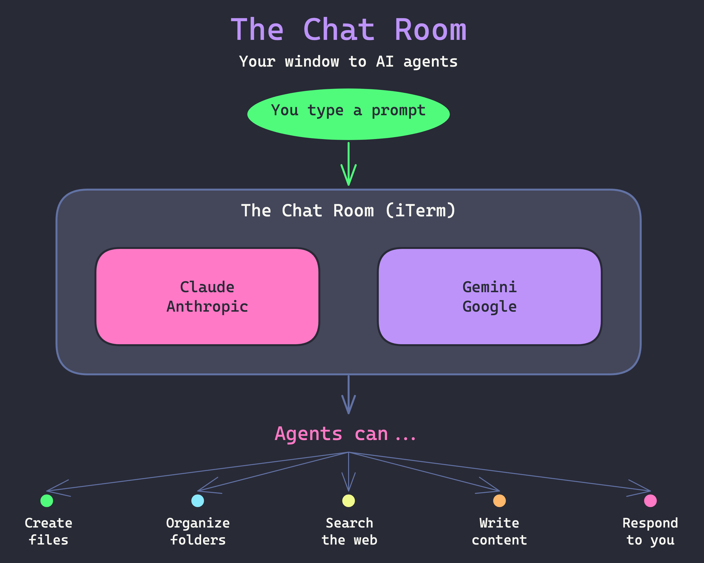

# The Chat Room

Welcome to your first real lesson, Karen! Last night you typed your first message into iTerm — today we're going to make that room yours, meet both of your AI agents, and watch them do some real work.

---

## Your Chat Room

You already know this window. It's got:

- A **dark background** with one of your kitten mascots faded behind the text
- A **"Karen learns AI"** watermark in the top right corner — so you always know you're in _your_ space
- Big, readable text in a friendly font

This is **The Chat Room** — the place where your AI agents live. It looks different from most apps, but it works the same way: you type, someone responds.

> [!NOTE] Why "The Chat Room"?
> The technical name is a _terminal_. But it's really just a text-based chat window. We'll keep calling it The Chat Room because that's what it is — a room where you have conversations with AI.

---

## Two Agents, One Room

You have two AI agents available, made by different companies:

- **Claude** (by Anthropic) — type `claude` to start
- **Gemini** (by Google) — type `gemini` to start

They're like having two student teachers. Each has their own personality and strengths. You'll get a feel for both today.

---

## . The Chat Room Overview



---

## Why a Text Window?

You might wonder: why not a pretty app with buttons?

These agents are most powerful in a text window because they can **do things** here — not just talk:

- Create files and folders
- Organize your work
- Search the web
- Build things for you

> [!TIP] Think of It This Way
> A regular chatbot is like a classroom helper who answers questions. An agent in The Chat Room is like a student teacher who can go off and _actually do things_ — organize the supply closet, prepare materials, set up the room — while you direct.

---

## Let's Start with Claude

**Action:** Open iTerm (you know how — it's in the Dock, or `Cmd + Space` and type "iTerm").

You should see your kitten background and the blinking cursor. Type:

```
claude
```

Press Enter. After a moment, Claude will introduce itself.

> [!SUCCESS] You Just Launched an AI Agent
> That one word started up one of the most capable AI tools available today. Everything in this curriculum happens right here.

---

## Your First Real Conversation

Now you're chatting with Claude. Try one of these prompts — or make up your own:

**Ask about something you know well:**
```
I'm a Montessori teacher. What do you know about the Montessori method?
```

**Or ask it to surprise you:**
```
Tell me three things about kittens that most people don't know.
```

Type your message and press Enter. Watch the response appear — just like texting, but your conversation partner knows a _lot_.

---

## Give Claude a Real Task

Here's where it gets interesting. Claude isn't just a chatbot — it can **do work**.

**Action:** Type this:

```
Can you create an organized set of folders in the workspace directory
for a Montessori teacher? Include folders for lesson plans, student
observations, and resources, with a short README in each explaining
what goes there.
```

Watch what happens. Claude will ask for permission, then actually create those folders and files on the computer. When it's done, you'll have a real, organized workspace — built in seconds from a single request.

> [!EXAMPLE] What Just Happened?
> You described what you wanted in plain English. Claude figured out a sensible folder structure and built it — folders, subfolders, README files, all organized. A chatbot would have _described_ a folder structure. An agent _built_ one.

---

## Time to Switch

Let's meet your other agent.

**Action:** Type `/exit` to leave Claude. You'll be back at the blinking cursor.

Now type:

```
gemini
```

Press Enter. Gemini will introduce itself — notice how it has a different style.

---

## Ask Gemini for a Slideshow

You've seen slideshows in this app already — they're just markdown files with slides separated by `---`. Let's ask Gemini to make one.

**Action:** Type:

```
Can you create a fun slideshow about kittens? Make it a markdown file
called workspace/kittens-slideshow.md with slides separated by ---
on their own lines. Include a title slide, at least 5 content slides
with interesting kitten facts, and use headings and bullet points.
```

Gemini will create a real slideshow file — one you could actually open and present in the kittens app!

---

## Two Agents, Different Styles

You just tried the same kind of task with two different agents. You probably noticed:

- They have different "voices" — one might be more formal, the other more casual
- They organize their responses differently
- Both can create files and do real work

Neither is "better" — they're different tools. Over time you'll develop preferences for which agent you reach for in different situations.

> [!WARNING] One Thing to Remember
> You can't break anything by typing the wrong thing. The worst that happens is an error message — and you just try again. The Chat Room is a safe space to experiment.

---

## The Chat Room vs. What You Already Know

| What You Know | The Chat Room |
|---|---|
| iMessage, Slack | iTerm |
| Tap a contact to start | Type `claude` or `gemini` to start |
| Type a message, hit Send | Type a message, hit Enter |
| See the reply appear | See the reply appear |
| Scroll up for history | Scroll up for history |
| Your contact can only text back | Your agent can text back _and do things_ |

The skills transfer. If you can text, you can use The Chat Room.

---

## Handy Things to Know

- **Scroll up** to re-read earlier messages (mouse scroll or trackpad)
- **Copy text** the same way as anywhere: select it and `Cmd + C`
- **If things look stuck**, just wait — the agent is thinking
- **To leave** a conversation: type `/exit` or press `Ctrl + C` a couple times
- **To start fresh**: just type `claude` or `gemini` again after exiting

---

## Today's Vocabulary

| Friendly Name | What It Really Is |
|---|---|
| **The Chat Room** | iTerm (a terminal app) |
| **The Prompt** | The message you type to the AI |

---

## Check Your Understanding

> [!QUESTION] Think About It
> 1. What's the difference between what Claude did when you asked it to create folders, versus what a regular chatbot would have done?
> 2. You tried two agents — Claude and Gemini. Did you notice any differences in how they responded?
> 3. What would you type to start a conversation with Claude? What about Gemini?

---

## What's Next

Next time, we'll look at what's actually happening behind the scenes when your agents respond. How do they "know" things? How do they come up with their answers? We'll meet **The Librarian** — and understand how your AI assistants really work.

For now, feel free to keep chatting. Try asking either agent about anything — your classroom, your Master's project, something you're curious about. The best way to get comfortable is to explore.
